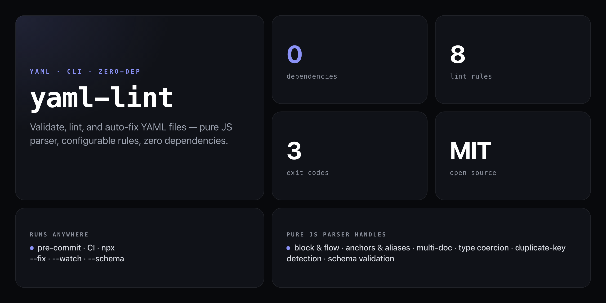

<div align="center">

**Validate, lint, and auto-fix YAML files. Pure JS parser. Zero dependencies.**


</div>

---

YAML errors in CI are silent killers — a misplaced indent or duplicate key passes the deploy step and breaks everything at runtime. `yaml-lint` catches them before they land: parse errors, lint rule violations, and schema mismatches, with optional auto-fix and a `--watch` mode for local dev.

```
$ npx github:NickCirv/yaml-lint --no-duplicate-keys --no-trailing-spaces src/

config/database.yaml
  12:1      error  Duplicate key: "host"  [parse]
  34:81     warn   Line length 94 exceeds max 80  [max-line-length]

config/app.yaml
  8:5       error  Trailing whitespace  [no-trailing-spaces]

────────────────────────────────────────
3 files checked · 2 errors · 1 warning
```

## Install

No global install needed — run directly from GitHub with zero dependencies:

```bash
npx github:NickCirv/yaml-lint <file|dir>
```

Or install globally:

```bash
npm install -g github:NickCirv/yaml-lint
```

## Usage

```bash
yaml-lint [options] <file|dir> [file|dir...]
```

| Flag | Description | Default |
|------|-------------|---------|
| `--fix` | Auto-fix formatting issues in place | — |
| `--format` | Reformat only, skip lint rules | — |
| `--indent <n>` | Required indent size | `2` |
| `--max-line-length <n>` | Warn on lines longer than n chars | `120` |
| `--no-trailing-spaces` | Error on trailing whitespace | — |
| `--require-document-start` | Require `---` at document start | — |
| `--no-duplicate-keys` | Error on duplicate keys | — |
| `--schema <file>` | Validate against a YAML schema file | — |
| `--json` | Output errors as JSON | — |
| `--watch` | Re-lint on file changes | — |
| `--no-color` | Disable color output | — |
| `-h, --help` | Show help | — |

### Examples

```bash
# Validate a single file
npx github:NickCirv/yaml-lint config.yaml

# Lint all YAML files in a directory recursively
npx github:NickCirv/yaml-lint src/

# Auto-fix trailing whitespace and indent issues
npx github:NickCirv/yaml-lint --fix --no-trailing-spaces config.yaml

# Strict mode: require document start, no duplicate keys
npx github:NickCirv/yaml-lint --require-document-start --no-duplicate-keys config.yaml

# Validate against a schema
npx github:NickCirv/yaml-lint --schema schema.yaml config.yaml

# JSON output for CI pipelines
npx github:NickCirv/yaml-lint --json config.yaml

# Watch mode for local development
npx github:NickCirv/yaml-lint --watch src/
```

## Schema Validation

Create a `schema.yaml` file to validate required keys and value types:

```yaml
required:
  - name
  - version
  - port
types:
  name: string
  version: string
  port: number
  enabled: boolean
properties:
  database:
    required:
      - host
    types:
      host: string
      port: number
```

Then validate against it:

```bash
npx github:NickCirv/yaml-lint --schema schema.yaml config.yaml
```

## Pure JS Parser

No `js-yaml`, no external packages. The built-in parser handles the full YAML subset you actually use in config files:

- Block and flow scalars, sequences, and mappings
- Single/double-quoted strings and multi-line block scalars (`|` literal, `>` folded)
- Anchors (`&anchor`) and aliases (`*alias`)
- Multi-document files (`---` separator)
- Type coercion: booleans, integers, floats, null, hex/octal
- Duplicate key detection
- Comments

## Lint Rules

| Rule | Flag | Severity |
|------|------|----------|
| `parse` | always on | error |
| `max-line-length` | `--max-line-length` | warning |
| `indent` | `--indent` | warning |
| `no-trailing-spaces` | `--no-trailing-spaces` | error |
| `require-document-start` | `--require-document-start` | warning |
| `trailing-newline` | always on | warning |
| `schema` | `--schema` | error |
| `duplicate-keys` | `--no-duplicate-keys` | error |

## Exit Codes

| Code | Meaning |
|------|---------|
| `0` | All files passed — no errors or warnings |
| `1` | One or more errors found |
| `2` | Warnings only (no errors) |

## CI Integration

```yaml
# GitHub Actions
- name: Lint YAML
  run: npx github:NickCirv/yaml-lint --no-duplicate-keys --no-trailing-spaces .
```

```bash
# Pre-commit hook — lint only staged YAML files
npx github:NickCirv/yaml-lint --json --no-duplicate-keys \
  $(git diff --cached --name-only | grep '\.ya\?ml$') || exit 1
```

## What it is NOT

- **Not a full YAML 1.2 implementation.** The parser handles the practical config-file subset — complex anchors-within-flow-sequences and some edge-case spec features are out of scope.
- **Not a replacement for `js-yaml` in application code.** This is a CLI linting tool, not a library you import.
- **Not a YAML formatter with opinionated style.** `--format` normalises whitespace and newlines; it does not reorder keys or enforce quoting style.

---

<div align="center">
<sub>Zero dependencies · Node 18+ · MIT · by <a href="https://github.com/NickCirv">NickCirv</a></sub>
</div>
